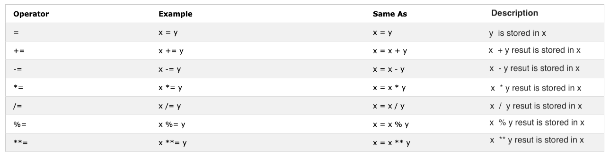
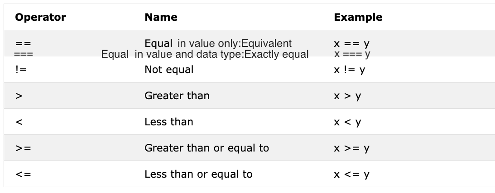
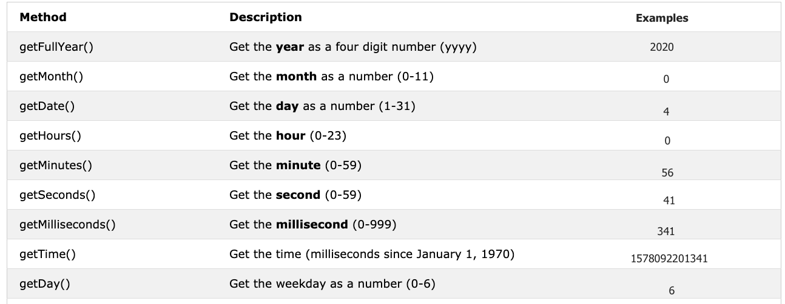

## Desafio 30 dias de javascript: dia 03

**Anotações**

Booleans

```javascript
let isLightOn = true
let isRaining = false
let isHungry = false
let isMarried = true
let truValue = 4 > 3    // true
let falseValue = 4 < 3  // false

```
Truthy values

    All numbers(positive and negative) are truthy except zero
    All strings are truthy except an empty string ('')
    The boolean true

Falsy values

    0
    0n
    null
    undefined
    NaN
    the boolean false
    '', "", ``, empty string


Operators



Arithmetic operators are mathematical operators.

    Addition(+): a + b
    Subtraction(-): a - b
    Multiplication(*): a * b
    Division(/): a / b
    Modulus(%): a % b
    Exponential(**): a ** b

Comparison Operators




Logical Operators

```javascript
// && ampersand operator example

const check = 4 > 3 && 10 > 5         // true && true -> true
const check = 4 > 3 && 10 < 5         // true && false -> false
const check = 4 < 3 && 10 < 5         // false && false -> false

// || pipe or operator, example

const check = 4 > 3 || 10 > 5         // true  || true -> true
const check = 4 > 3 || 10 < 5         // true  || false -> true
const check = 4 < 3 || 10 < 5         // false || false -> false

//! Negation examples

let check = 4 > 3                     // true
let check = !(4 > 3)                  //  false
let isLightOn = true
let isLightOff = !isLightOn           // false
let isMarried = !false                // true
```

Increment Operator
In JavaScript we use the increment operator to increase a value stored in a variable. The increment could be pre or post increment. Let us see each of them:

Pre-increment
```javascript
let count = 0
console.log(++count)        // 1
console.log(count)   
```

Post-increment
```javascript

let count = 0
console.log(count++)        // 0
console.log(count)          // 1

```

We use most of the time post-increment. At least you should remember how to use post-increment operator.

Decrement Operator

In JavaScript we use the decrement operator to decrease a value stored in a variable. The decrement could be pre or post decrement. Let us see each of them:

```javascript
Pre-decrement
let count = 0
console.log(--count) // -1
console.log(count)  // -1
Post-decrement
let count = 0
console.log(count--) // 0
console.log(count)   // -1

```

Ternary Operators

Ternary operator allows to write a condition. Another way to write conditionals is using ternary operators. Look at the following examples:

```javascript
let isRaining = true
isRaining
  ? console.log('You need a rain coat.')
  : console.log('No need for a rain coat.')
isRaining = false

isRaining
  ? console.log('You need a rain coat.')
  : console.log('No need for a rain coat.')
```

```
You need a rain coat.
No need for a rain coat.

```

Window Methods

* alert()

        alert('Welcome to 30DaysOfJavaScript')
        
* prompt()

        let number = prompt('Enter number', 'number goes here')
        console.log(number)

* confirm()

        const agree = confirm('Are you sure you like to delete? ')
        console.log(agree) // result will be true or false based on what you click on the dialog box    


Date Object



```javascript
const now = new Date()

console.log(now) // Sat Jan 04 2020 00:56:41 GMT+0200 (Eastern European Standard Time)

console.log("year: ", now.getFullYear()) // 2020
console.log("month: ", now.getMonth()) // 0, because the month is January,  month(0-11)
console.log("date/day of the month: ", now.getDate()) // 4, because the day of the month is 4th,  day(1-31)
console.log("day of the week", now.getDay())
console.log("hours: ", now.getHours())
console.log("minutes: ", now.getMinutes()) // 56, because the time is 00:56:41
console.log("seconds: ", now.getSeconds()) // 41, because the time is 00:56:41


```


Getting time

This method give time in milliseconds starting from January 1, 1970. It is also know as Unix time. We can get the unix time in two ways:

Using getTime()

        const now = new Date() //
        console.log(now.getTime()) // 1578092201341, this is the number of seconds passed from January 1, 1970 to January 4, 2020 00:56:41


Using Date.now()

        const allSeconds = Date.now() //
        console.log(allSeconds) // 1578092201341, this is the number of seconds passed from January 1, 1970 to January 4, 2020 00:56:41
        const timeInSeconds = new Date().getTime()
        console.log(allSeconds == timeInSeconds) // true


**Exercicios:**

💻 Day 3: Exercises
Exercises: Level 1
Declare firstName, lastName, country, city, age, isMarried, year variable and assign value to it and use the typeof operator to check different data types.

Check if type of '10' is equal to 10

Check if parseInt('9.8') is equal to 10

Boolean value is either true or false.

Write three JavaScript statement which provide truthy value.
Write three JavaScript statement which provide falsy value.
Figure out the result of the following comparison expression first without using console.log(). After you decide the result confirm it using console.log()

4 > 3
4 >= 3
4 < 3
4 <= 3
4 == 4
4 === 4
4 != 4
4 !== 4
4 != '4'
4 == '4'
4 === '4'
Find the length of python and jargon and make a falsy comparison statement.
Figure out the result of the following expressions first without using console.log(). After you decide the result confirm it by using console.log()

4 > 3 && 10 < 12
4 > 3 && 10 > 12
4 > 3 || 10 < 12
4 > 3 || 10 > 12
!(4 > 3)
!(4 < 3)
!(false)
!(4 > 3 && 10 < 12)
!(4 > 3 && 10 > 12)
!(4 === '4')
There is no 'on' in both dragon and python
Use the Date object to do the following activities

What is the year today?
What is the month today as a number?
What is the date today?
What is the day today as a number?
What is the hours now?
What is the minutes now?
Find out the numbers of seconds elapsed from January 1, 1970 to now.
Exercises: Level 2
Write a script that prompt the user to enter base and height of the triangle and calculate an area of a triangle (area = 0.5 x b x h).

Enter base: 20
Enter height: 10
The area of the triangle is 100
Write a script that prompt the user to enter side a, side b, and side c of the triangle and and calculate the perimeter of triangle (perimeter = a + b + c)

Enter side a: 5
Enter side b: 4
Enter side c: 3
The perimeter of the triangle is 12
Get length and width using prompt and calculate an area of rectangle (area = length x width and the perimeter of rectangle (perimeter = 2 x (length + width))

Get radius using prompt and calculate the area of a circle (area = pi x r x r) and circumference of a circle(c = 2 x pi x r) where pi = 3.14.

Calculate the slope, x-intercept and y-intercept of y = 2x -2

Slope is m = (y2-y1)/(x2-x1). Find the slope between point (2, 2) and point(6,10)

Compare the slope of above two questions.

Calculate the value of y (y = x2 + 6x + 9). Try to use different x values and figure out at what x value y is 0.

Writ a script that prompt a user to enter hours and rate per hour. Calculate pay of the person?

Enter hours: 40
Enter rate per hour: 28
Your weekly earning is 1120
If the length of your name is greater than 7 say, your name is long else say your name is short.

Compare your first name length and your family name length and you should get this output.

let firstName = 'Asabeneh'
let lastName = 'Yetayeh'
Your first name, Asabeneh is longer than your family name, Yetayeh
Declare two variables myAge and yourAge and assign them initial values and myAge and yourAge.

let myAge = 250
let yourAge = 25
I am 225 years older than you.
Using prompt get the year the user was born and if the user is 18 or above allow the user to drive if not tell the user to wait a certain amount of years.

Enter birth year: 1995
You are 25. You are old enough to drive

Enter birth year: 2005
You are 15. You will be allowed to drive after 3 years.
Write a script that prompt the user to enter number of years. Calculate the number of seconds a person can live. Assume some one lives just hundred years

Enter number of years you live: 100
You lived 3153600000 seconds.
Create a human readable time format using the Date time object

YYYY-MM-DD HH:mm
DD-MM-YYYY HH:mm
DD/MM/YYYY HH:mm
Exercises: Level 3
Create a human readable time format using the Date time object. The hour and the minute should be all the time two digits(7 hours should be 07 and 5 minutes should be 05 )
YYY-MM-DD HH:mm eg. 20120-01-02 07:05

```javascript


```